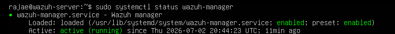
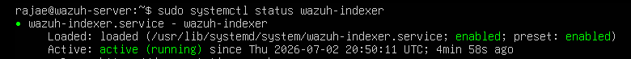
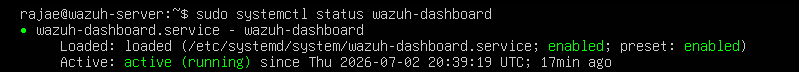
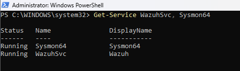

# Wazuh SIEM Home Lab with Sysmon Integration

## Project Overview

This project documents the design, deployment, and validation of a Security Information and Event Management (SIEM) home lab using Wazuh and Microsoft Sysmon. The lab was built in VMware Workstation with an Ubuntu Server hosting the Wazuh Manager, Indexer, and Dashboard, and a Windows 11 endpoint configured with the Wazuh Agent and Sysmon.

The goal of the project was to gain hands-on experience deploying a SIEM, collecting Windows security telemetry, creating custom detection rules, and investigating alerts through the Wazuh Dashboard. Throughout the project, I configured secure log collection, validated end-to-end event ingestion, and documented the environment to demonstrate practical SOC analyst skills.

## Objectives

- Deploy a Wazuh SIEM environment on Ubuntu Server.
- Configure a Windows 11 endpoint with the Wazuh Agent.
- Install and configure Microsoft Sysmon for enhanced event logging.
- Collect and analyze Windows Security and Sysmon events.
- Create and validate a custom Wazuh detection rule.
- Map detections to the MITRE ATT&CK framework.
- Develop practical skills in security monitoring, log analysis, and SIEM administration.
- Document the project for a professional cybersecurity portfolio.

- ## Technologies Used

| Technology | Purpose |
|------------|---------|
| Wazuh | Security Information and Event Management (SIEM) platform |
| Ubuntu Server | Hosts the Wazuh Manager, Indexer, and Dashboard |
| Windows 11 | Monitored endpoint |
| Microsoft Sysmon | Enhanced Windows event logging |
| Wazuh Agent | Collects endpoint logs and securely forwards them to the Wazuh Manager |
| VMware Workstation Pro | Virtualization platform |
| ossec.conf | Configured the Wazuh Agent to collect Sysmon event logs |
| MITRE ATT&CK Framework | Threat classification and mapping |
| GitHub | Project documentation and version control |

## Lab Environment

The lab was built in VMware Workstation Pro using two virtual machines connected through a private virtual network.

| Virtual Machine | Operating System | IP Address | Role |
|----------------|------------------|------------|------|
| Wazuh Server | Ubuntu Server | 192.168.74.128 | Hosts the Wazuh Manager, Indexer, and Dashboard |
| Windows Endpoint | Windows 11 | 192.168.74.129 | Generates Windows and Sysmon events that are collected by the Wazuh Agent |

## Network Communication

The lab used Wazuh's default communication ports to securely register the Windows endpoint, forward security events to the Wazuh server, and provide encrypted access to the web dashboard.

| Port | Purpose |
|------|---------|
| TCP 1514 | Secure transmission of Windows Event Logs and Sysmon events from the Wazuh Agent to the Wazuh Manager |
| TCP 1515 | Registers the Windows endpoint with the Wazuh Manager during agent enrollment |
| TCP 443 | Secure HTTPS access to the Wazuh Dashboard for monitoring alerts and events |

## Lab Workflow

The following workflow illustrates how security events are collected, processed, and analyzed within the Wazuh lab environment.

### 1. Generate Endpoint Activity
The Windows 11 endpoint generates normal operating system events through user activity, application execution, file creation, and system processes. Sysmon extends native Windows logging by recording detailed security telemetry such as process creation, file creation, network connections, and registry modifications.

### 2. Collect Security Events
The Wazuh Agent monitors both Windows Event Logs and the Sysmon Operational log. These events are collected in real time and prepared for secure transmission to the Wazuh Manager.

### 3. Secure Event Transmission
The Wazuh Agent securely forwards collected events to the Wazuh Manager using TCP port 1514. During the initial deployment, the Windows endpoint registers with the Wazuh Manager over TCP port 1515 before event collection begins.

### 4. Event Analysis
The Wazuh Manager normalizes incoming events and evaluates them against built-in detection rules. Matching events generate alerts with severity levels and MITRE ATT&CK technique mappings when applicable.

### 5. Alert Indexing
Processed alerts are stored by the Wazuh Indexer, enabling fast searching, filtering, and historical analysis of security events.

### 6. Security Monitoring
The Wazuh Dashboard retrieves indexed data and presents alerts, dashboards, MITRE ATT&CK mappings, and endpoint activity through a centralized web interface accessed over HTTPS (TCP 443).

### 7. Detection Validation
To validate the deployment, Sysmon events were successfully collected from the Windows endpoint and displayed within the Wazuh Dashboard, confirming that the agent, manager, indexer, and dashboard were functioning correctly.

## Validation

The following validation steps confirmed that the Wazuh deployment was functioning correctly:

- Verified the Wazuh Manager, Indexer, and Dashboard services were running on the Ubuntu Server.
- Verified the Wazuh Agent and Microsoft Sysmon services were running on the Windows 11 endpoint.
- Verified the Windows 11 endpoint successfully registered with the Wazuh Manager.
- Confirmed endpoint inventory information was collected and displayed in the Wazuh Dashboard.
- Verified Sysmon Process Creation (Event ID 1) events were successfully ingested.
- Confirmed a built-in Wazuh detection rule generated a Level 15 security alert from Sysmon telemetry.
- Verified Sysmon File Creation (Event ID 11) events were successfully ingested.
- Validated MITRE ATT&CK mappings associated with generated alerts.

## Deployment Validation Evidence

The following screenshots document each stage of the Wazuh SIEM deployment, demonstrating successful infrastructure verification, endpoint onboarding, security telemetry collection, and alert generation.

---

## Phase 1 – Infrastructure Verification

Before onboarding endpoints, the core Wazuh services were verified to ensure the SIEM infrastructure was fully operational.

### Wazuh Manager

**Purpose:**  
Verified that the Wazuh Manager service was active and running on the Ubuntu Server.

---

### Wazuh Indexer

**Purpose:**  
Verified that the Wazuh Indexer service was active (`active (running)`), confirming security events could be indexed and stored for searching and analysis.

---

### Wazuh Dashboard

**Purpose:**  
Verified that the Wazuh Dashboard service was active (`active (running)`), confirming the web interface was available for monitoring and investigation.

---

### Windows Endpoint Services

**Purpose:**  
Verified that both the Wazuh Agent (WazuhSvc) and Microsoft Sysmon (Sysmon64) services were running on the Windows 11 endpoint, confirming endpoint monitoring was operational.

---

## Phase 2 – Endpoint Onboarding

After confirming the SIEM infrastructure was operational, the Windows 11 endpoint was successfully enrolled and validated within the Wazuh environment.

### Active Endpoint Enrollment

**Purpose:**  
Verified that WIN11-ENDPOINT successfully registered with the Wazuh Manager and was communicating as an active monitored endpoint.

*Insert Active Endpoint screenshot*

---

### Endpoint Asset Inventory

**Purpose:**  
Verified that Wazuh successfully collected endpoint inventory information including the operating system, IP address, hardware specifications, and agent metadata.

*Insert Endpoint Inventory screenshot*

---

## Phase 3 – Detection Validation

After endpoint onboarding, Sysmon telemetry was collected, analyzed by Wazuh, and used to generate security alerts.

### Sysmon Process Creation (Event ID 1)

**Purpose:**  
Verified that Sysmon Process Creation (Event ID 1) events were successfully collected, forwarded, and displayed within the Wazuh Dashboard.

*Insert Event ID 1 screenshot*

---

### Wazuh Detection Alert (Rule ID 92213)

**Purpose:**  
Verified that a built-in Wazuh detection rule generated a Level 15 security alert after analyzing Sysmon telemetry.

*Insert Level 15 Alert screenshot*

---

### Detection Rule Details and MITRE ATT&CK Mapping

**Purpose:**  
Verified that the generated alert included Rule ID 92213, severity level, and the associated MITRE ATT&CK tactic and technique for additional investigation context.

*Insert Detection Rule screenshot*

---

### Sysmon File Creation (Event ID 11)

**Purpose:**  
Verified that Sysmon File Creation (Event ID 11) events were successfully collected and analyzed by the Wazuh platform, demonstrating additional endpoint telemetry beyond process creation events.

*Insert Event ID 11 screenshot*
